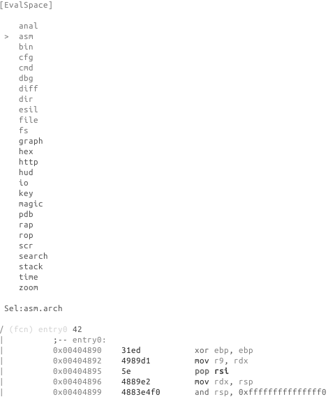
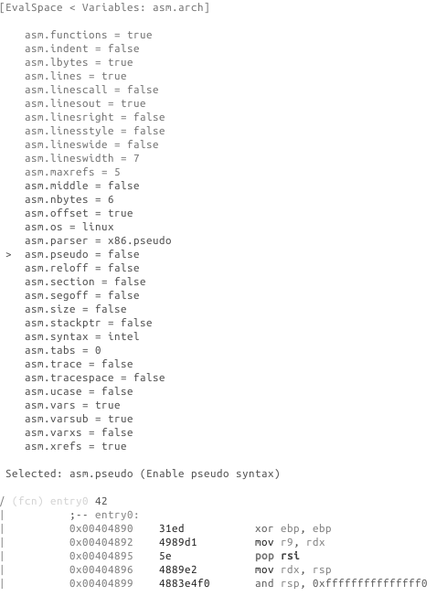
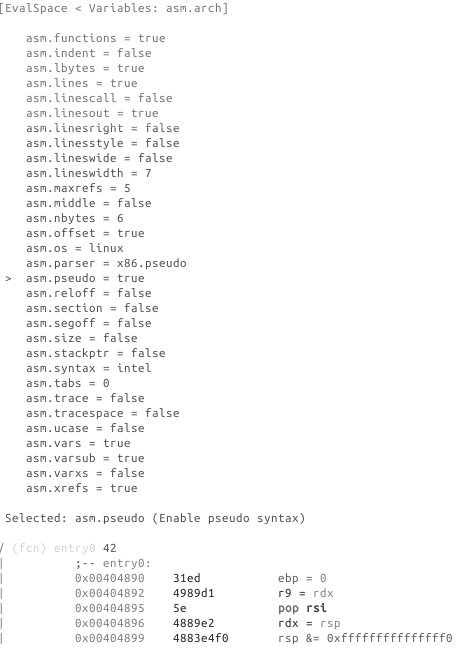

# 配置编辑器

`Ve` or `e` in visual mode allows you to edit radare2 configuration visually. For example, if you want to change the assembly display just select `asm` in the list and choose your assembly display flavor.

Example switch to pseudo disassembly:

